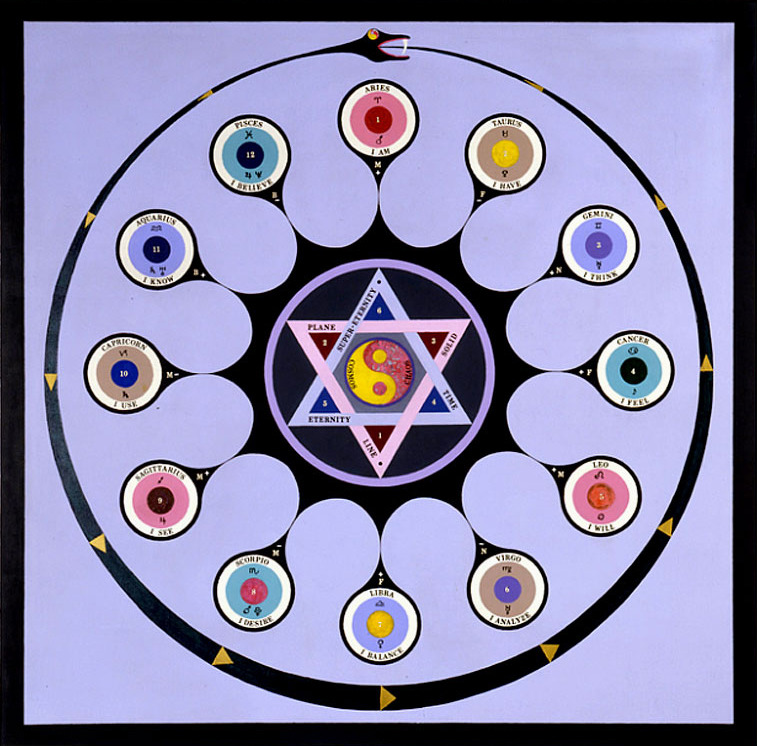
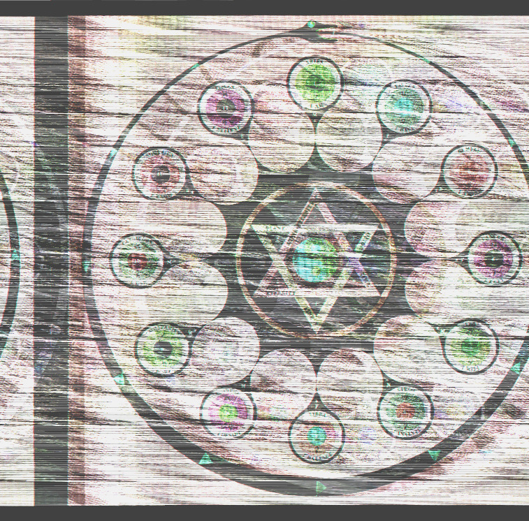
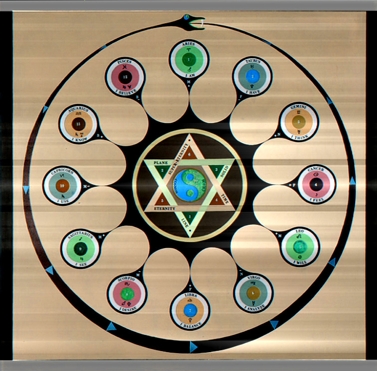

# Alghemy
### Transmute your data with ease.

## Synopsis

Alghemy is a Ruby library built to facilitate the manipulation of data for artistic purpose.
It is intended for use as a mini [domain-specific language](https://en.wikipedia.org/wiki/Domain-specific_language).
It can recognise multiple sound, video, and image formats, convert between them, and automate unpredictable processes.


## Installation

All functionality is available through your Ruby REPL once you download/clone this repository.
The gem version of the library is currently offline by intention, but can easily be built natively.

- Clone this repository or download as zip and extract. Then, you may optionally:
   - `cd` into directory and run:
   ```
   gem build alghemy.gemspec
   gem install alghemy-0.1.0.gem
   ```
   - add alghemy/bin to your system path.


## Requirements

### Programs

Alghemy uses the following programs to process files, and expects them to be installed:

- Video-based processes
  - [ffmpeg](https://ffmpeg.org)
- Image-based processes
  - [imagemagick](www.imagemagick.org/script/index.php)
    - Alghemy intentionally uses the deprecated `convert` utility from imagemagick 6.9 or lower.
    If you are installing imagemagick 7.0 or above, make sure to include legacy utilities.
- Sound-based processes
  - [sox](sox.sourceforge.net)
- VST-related processes
  - [mrswatson](https://github.com/teragonaudio/MrsWatson)

NOTE: To perform image-based fast-fourier transforms, your version of ImageMagick must support the [fftw](www.fftw.org) delegate.
To check for this functionality, run `convert --version` and look for `fftw` in the `Delegates (built-in):` section.

### Gems

Alghemy uses the following gem:

- [listen](https://github.com/guard/listen) \- Used to monitor directories for changes.
Install with `gem install listen`.


## Usage

Alghemy is intended to be used in a REPL environment. There are a couple of ways to make this happen:
- Start your Ruby REPL
  - run `require_relative path/to/alghemy/lib/alghemy.rb`
  - If you built the gem, you can use `require 'alghemy'` instead.
- Run `alghemy` to open irb with library functionality enabled.
  This is only available if you built the gem or added bin to your path.


### Initalising Matter
In Alghemy, the Matter class is a base representation of a file or files.
To alter a file, you should evoke a Matter object to represent it.

In this example a typical image file is used.
```ruby
fire = Matter.evoke 'ouroboros.png'
=> #<Image:0x0000000ff2df50 @sijil="ouroboros.png">
```

### Aspects

Sounds, images, and videos can have different aspects depending on their format.
Broadly speaking, these are the typical aspects that are available for them. All relevant aspects are defined as accessor methods on Matter of that affinity. Use the `aspects` method to return a list of these aspects.

#### Image and Video
`space` - spacial dimension ("horizontal x vertical")

#### Video and Sound
`time` - temporal dimension (in seconds)

Because Video and Sound elements are perceivable in the temporal dimension,
they possess two other related aspects:

`freq` - rate (Video:framerate || Sound:samplerate)  
`lifespan` - total (Video:frames || Sound:samples)

#### Sound and Image
`depth` - bitdepth (Integer)

#### All affinities
`arcana` - (Video:pixel-format || Sound:encoding || Image:colorspace)

### Viewing Matter
There are two methods with which to view Matter: `behold` opens the file via a terminal-accessible executable, defaults being `ffplay` (ffmpeg), `play` (sox), and `xnview` (Windows specific).  `open` will open the file with the default application your computer has linked to the extension.




### Sonification
One of the primary features of Alghemy is the sonification of data. This is the process of converting arbitrary data - in this case an image - into sound. This allows you to manipulate data in unpredictable ways. To do this, we can use the sonify method:
```ruby
air = fire.sonify
=> #<Sound:0x000000119d9048
 @mems=
  [[:sonify,
    {:ents=>[["un", 8], ["flo", 32]], :extype=>[".png", Image]}]],
 @sijil="Alghemy/ouroboros/son.wav">
```

### Sublimation
Now we have the data of our image encoded as a sound file. We could try and alter this data, but as it represents a compressed image format (png), we'd have to be careful about how we do it. For now, let's step back and convert our image to a raw format. This will transmute the data into a much more robust representation. We can do this with the sublimate method:
```ruby
earth = fire.sublimate
=> #<Element:0x00000010a18ff0
 @mems=
  [[:sublimate, {:space=>"757x746", :depth=>8, :extype=>[".png", Image]}]],
 @sijil="Alghemt/ouroboros/sub.rgb">
```

Notice the class of Object we got is named Element; this signifies data that is unidentifiable, and includes all raw formatted data. Since we didn't pass any options, the default raw image format of rgb was used. The transform recorded the dimensions and bitdepth of the image for us; this will come in handy later.  For now, let's sonify our raw image.
```ruby
air = earth.sonify
=> #{Sound:0x000000107c5910
 @mems=
  [[:sonify,
    {:ents=>[["un", 8], ["flo", 32]], :extype=>[".rgb", Element]}]],
   [:sublimate, {:space=>"757x746", :depth=>8, :extype=>[".png", Image]}]],
 @sijil="Alghemy/ouroboros/sub-son.wav">
```

### Mutation
This is a much more robust representation of our image in the sound domain. A great way to change sound data is with effects such as reverb and delay.  Many such effects are distributed digitally as VST effect plugins. If we apply such an effect to the sound of our image, the data will change, and so therefore the image must also change. What will it look like? Using this method requires that you install your own VST effects as required by [mrswatson](https://github.com/teragonaudio/MrsWatson).
```ruby
air = air.mutate
=> #<Sound:0x0000000f8c9ec0
 @mems=
  [[:mutate,
    {:vst=>#<Vst:0x0000000f8cb6f8 @sijil="sykk">,
     :extype=>[".wav", Sound]}],
  [[:sonify,
    {:ents=>[["un", 8], ["flo", 32]], :extype=>[".rgb", Element]}]],
   [:sublimate, {:space=>"757x746", :depth=>8, :extype=>[".png", Image]}]],
 @sijil="Alghemy/ouroboros/sub-son-(M).wav">
```

### Reversion
Here is our processed sound file. We didn't explicity choose which effect to use, so alghemy selected one at random for us. Now we're going to use the information stored in `@mems` to revert any transpositions (Transmutations that do not irreversibly alter data), and give us back an image.
```ruby
fire = air.revert
=> #<Image:0x000000117c1ff8 @sijil="Alghemy/ouroboros/sub-son-(M)(R2).png">
fire.behold
```



### Chaining Transmutations
The above steps can all be accomplished with a single command, as Transmutations always return new Matter:
```ruby
fire.sublimate.sonify.mutate.revert.open
=> #<Image:0x0000001188b9c0 @sijil="Alghemy/ouroboros/sub-son-(M)(R2).png">
```



## Development

Alghemy is under very active development, and all code should be considered volatile. If you are interested in contributing please contact me at m.reinhardt@gmx.co.uk.

## License

The entirety of this library is available as open source under the terms of the [GPLv3 License](https://www.gnu.org/licenses/gpl.html).
